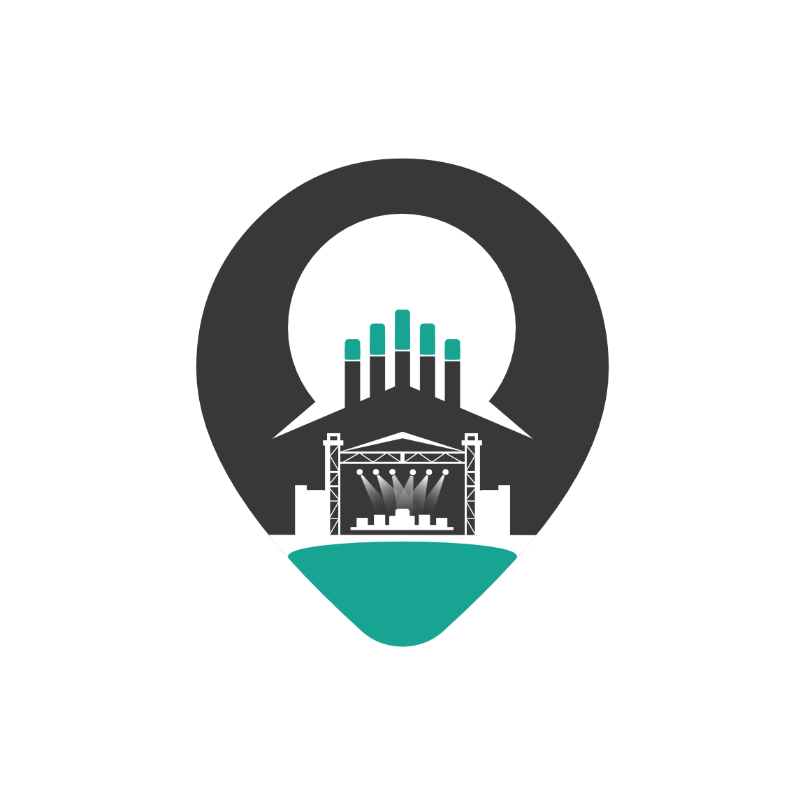
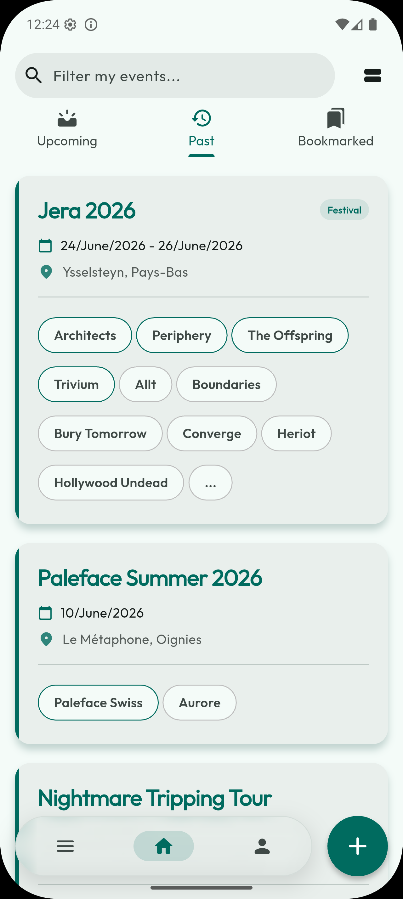
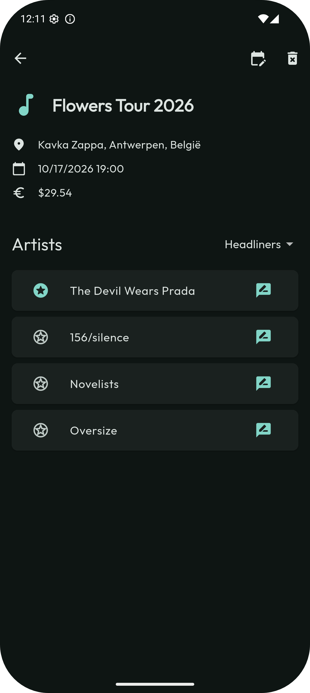
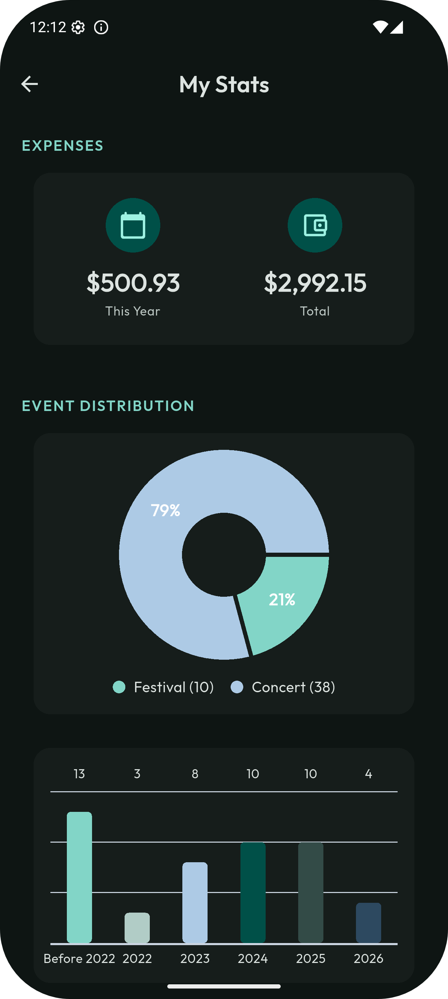
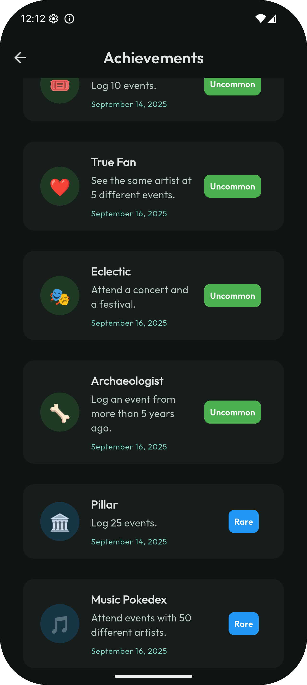
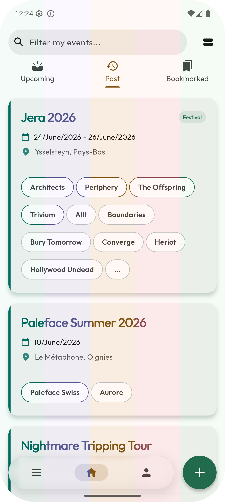
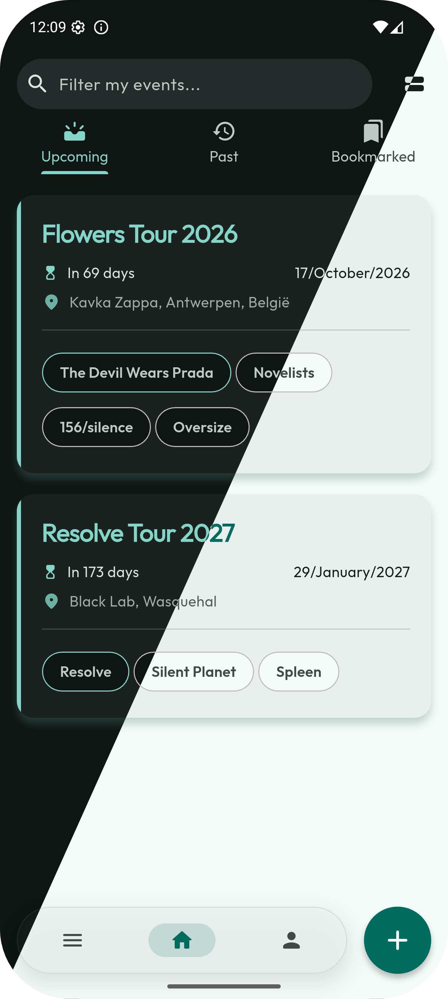

  
  <h1>EvntTrackr 🎵</h1>
  
<em>Your personal journal to track all your concerts, festivals, and musical events!</em>

  
  

    
  

  
  <h3>👇 Download the App 👇</h3>
  
  
  
  

---

## 📱 App Overview

> **Note for adding images**: Place your 4 screenshots in a `screenshots` folder and name them as indicated in the links below so they appear automatically.

| My Dashboard | My Concerts in Detail |
|:---:|:---:|
|  *A quick overview of your upcoming concerts and past memories.* |  *All the information about an event: location, date, artists, and your personal notes.* |

| My Statistics | My Profile & Achievements |
|:---:|:---:|
|  *Discover your favorite genres, your most-seen artists, and your concert habits.* |  *Unlock achievements as you attend more events and customize your experience.* |

### 🎨 Material You Integration

EvntTrackr fully supports **Material You** (Dynamic Color). The application automatically adapts its color palette based on your device's wallpaper, providing a unique and personalized experience tailored just for you!

  
  

## ✨ Why use EvntTrackr?

- 🎫 **Never forget a concert**: Keep a permanent record of every artist, festival, and venue you visit.
- 📊 **Analyze your passion**: Simple and beautiful charts to visualize your musical life (most seen artists, budget, etc.).
- 🏆 **Collect memories**: Unlock virtual badges as you reach new milestones.
- 🌍 **Adapts to you**: Multi-language app with automatic dark and light modes.
- 🔔 **Automatic reminders**: Get notified so you never miss the start of a festival.

## 📥 How to Install?

### On Android
1. Go to the **[Releases](../../releases/latest)** tab on this page.
2. Download the latest `.apk` file.
3. Open the file on your phone (if prompted, allow the installation of apps from unknown sources).
4. Open the app and enjoy!

## 💬 Found a bug? Have an idea?

The app is constantly improving! If you encounter an issue or have a great idea for a new feature, don't hesitate to let me know:
👉 **[Open an Issue](../../issues/new)**

---

  <i>Made with ❤️ for music lovers.</i>

